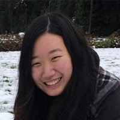

# The Hands-Free Music Project

Our project aims to enable people with limited mobility, specifically people living with ALS, to be able to create music.  We want people who only have the use of their eyes to create music in real-time so that they have more ways to express themselves artistically.

## Who We Are

### Parker Ciambrone
I am senior in the Informatics program with focuses on Information Architecture and Data Science.  I am interested in developing applications that create new, useful experiences for people.  When I'm not coding, I enjoy listening to music, hiking, and photography.

Email: [parkreno@uw.edu](mailto:parkreno@uw.edu)

### Cole French
I'm an Informatics senior on the Data Science track. Before I began pursuing a career in tech, I had a passion for teaching and learning sciences – or studying how we learn. I soon realized how technology can often not work for students in the classroom, and so I switched majors to work on improving accessibility and user experience for all. I look forward to seeing where this project goes and how it can impact the growing realm of music tech!

Email: [cjf96@uw.edu](mailto:cjf96@uw.edu)

### Wesley Wei

I am currently a Senior studying Informatics at the University of Washington. I am interested in how information shapes our world especially in the technology world. My role on this team is to serve as a developer. In my free time, I enjoy playing the violin and playing table tennis.

Email: [weswei@uw.edu](mailto:weswei@uw.edu)

### Emily Ye

I am a senior Informatics student with tracks on data science and cybersecurity. I enjoy learning about different aspects of technology, in order to be able to bring people and technology together in better ways. I have a great passion for music and piano, so I wish to share that passion and joy with more people through this project!

Email: [emilyye@uw.edu](mailto:emilyye@uw.edu)

### Microsoft Research
Our project's sponsor, Microsoft Research, is helping us with valuable expertise, mentorship, and access to hardware.

### The University of Washington iSchool
This project is part of the iSchool's yearly Capstone.

## Contact

We would love to hear from people who have expertise in our space or want to test out our prototypes!  Email us at [dubstep@uw.edu](mailto:dubstep@uw.edu).
